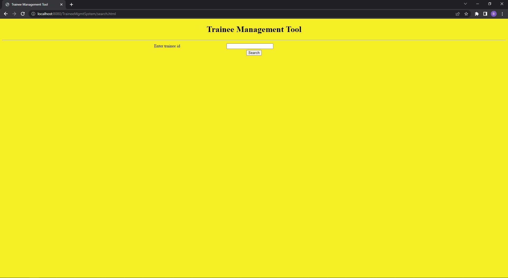
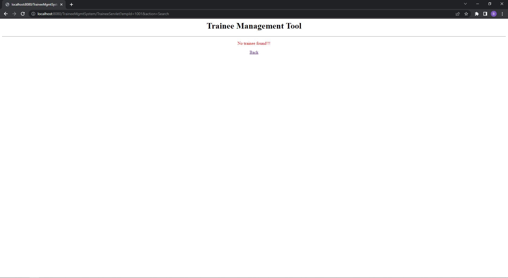
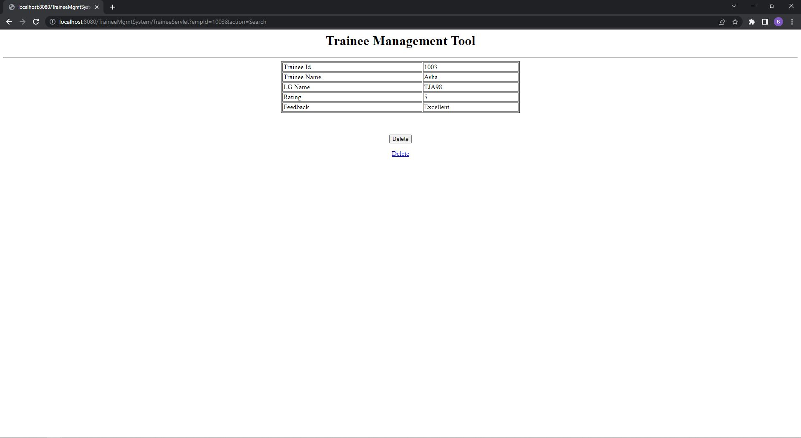
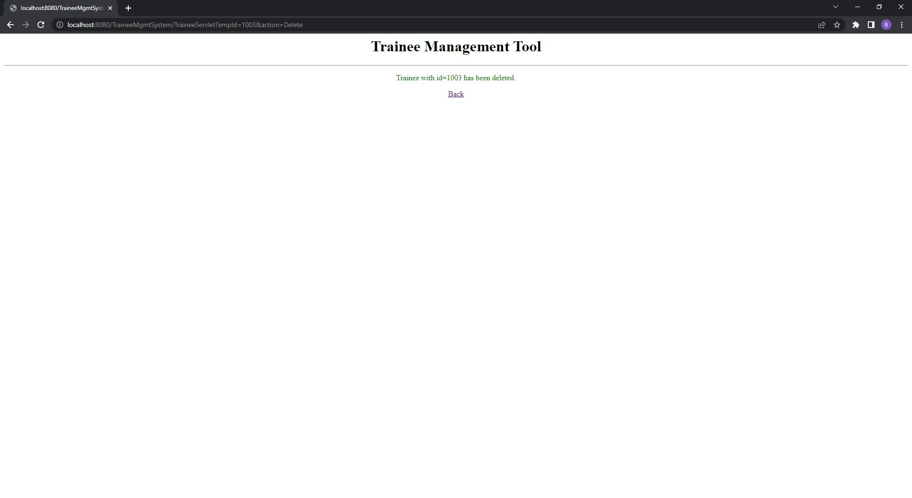

# Hello

This is a simple CRUD application made in Java, using DerbyDB as the database, and with Java's native Java Servlets technology. This is meant to be an exploration into what I can do with Servlets.

It doesn't have a complex UI templating engine or framework. Instead, I am simply printing the html on the page directly from the servlet.

The application itself, is a trainee management system. It can query the database for trainee ids, display the trainee information, and provide the option to delete the record from the DB.

Search Page:



Search Failed:



Search Success:



Delete Success:



# About the DB

DerbyDB is an RDBMS. I just have one table, "trainee"

```Java
String sql = "CREATE TABLE trainee (emp_id int primary key, name varchar(100), lg_name varchar(10), rating int, feedback varchar(50))";
statement.execute(sql);
```

This is how I inserted the multiple records:

```Java
statement.executeUpdate("INSERT INTO trainee VALUES (1001,'John', 'TJA98', 5, 'Excellent')");
statement.executeUpdate("INSERT INTO trainee VALUES (1002,'Sean', 'TJA98', 5, 'Excellent')");
statement.executeUpdate("INSERT INTO trainee VALUES (1003,'Joe', 'TJA98', 5, 'Excellent')");
statement.executeUpdate("INSERT INTO trainee VALUES (1004,'Bob', 'TJA98', 4, 'Good')");
statement.executeUpdate("INSERT INTO trainee VALUES (1005,'Smith', 'TJA99', 4, 'Good')");
statement.executeUpdate("INSERT INTO trainee VALUES (1006,'Lee', 'TJA100', 3, 'Average')");
```

# How to use

To run it, either compile it to a WAR file and manually run it on any webserver, or just use your IDE's built in tools. I used Eclipse with Tomcat.
